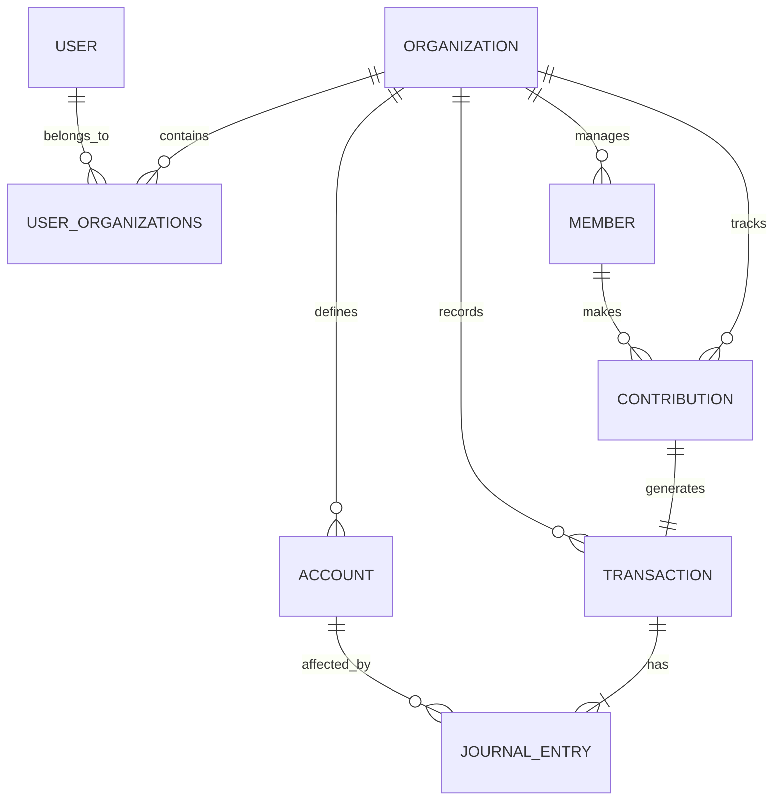

# Esquema de Base de Datos (Conceptual)

Este esquema utiliza una arquitectura **Multitenant** basada en discriminadores (`organization_id`) y políticas de seguridad a nivel de fila (RLS).

## 1. Entidades Principales

### Core / Multitenancy
- **organizations:** Tabla maestra de empresas o iglesias.
  - `id`, `name`, `type` (CHURCH | BUSINESS), `tax_id` (NIT), `settings` (JSON).
- **users:** Usuarios del sistema.
  - `id`, `email`, `full_name`.
- **user_organizations:** Relación muchos-a-muchos con roles.
  - `user_id`, `organization_id`, `role` (ADMIN, ACCOUNTANT, TREASURER, VIEWER).

### Contabilidad General
- **accounts (PUC):** Plan Único de Cuentas.
  - `id`, `organization_id`, `code` (ej: 110505), `name`, `parent_id` (jerarquía), `type` (ASSET, LIABILITY, etc.).
- **transactions:** Cabecera de los asientos contables.
  - `id`, `organization_id`, `date`, `description`, `reference_no`, `created_by`.
- **journal_entries:** Detalles de partida doble.
  - `id`, `transaction_id`, `account_id`, `debit`, `credit`, `notes`.

### Módulo Iglesia (Extensión)
- **members:** Feligreses.
  - `id`, `organization_id`, `full_name`, `document_id`, `phone`, `is_active`.
- **contributions:** Registro específico de diezmos y ofrendas.
  - `id`, `organization_id`, `member_id` (opcional), `transaction_id` (FK a contabilidad), `category` (TITHE, OFFERING, SPECIAL), `fund_id`.
- **funds:** Fondos específicos.
  - `id`, `organization_id`, `name` (ej: Pro-Templo, Misiones), `balance`.

## 2. Diagrama de Relaciones (Mermaid)

## 3. Consideraciones de Diseño
1.  **Integridad Contable:** Cada `contribution` genera automáticamente una `transaction` con sus respectivos `journal_entries` (ej: Débito a Caja, Crédito a Ingreso por Diezmos).
2.  **Multitenancy:** Todas las consultas deben filtrar por `organization_id`. En Supabase/Postgres, esto se automatiza con **Row Level Security (RLS)**.
3.  **Flexibilidad:** El campo `type` en `organizations` permite activar o desactivar módulos específicos de interfaz (ej: ocultar el botón de "Diezmos" si es una ferretería).
