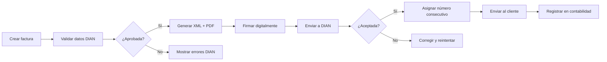

# Especificación Funcional Detallada por Módulo

## 1. MÓDULO DE AUTENTICACIÓN Y USUARIOS

### 1.1 Registro de Usuario/Organización

**Flujo:**
1. Usuario accede a la pantalla de registro
2. Completa formulario con:
   - Nombre de la organización
   - Tipo (Iglesia / Empresa / Otro)
   - Nombre del administrador
   - Email
   - Contraseña (con validación de fortaleza)
   - País/Región (para configuraciones locales)
3. Sistema envía email de verificación
4. Usuario confirma email
5. Sistema crea:
   - Organización en base de datos
   - Usuario administrador principal
   - Plan de cuentas por defecto según tipo
   - Configuraciones iniciales

**Funcionalidades:**
- ✅ Validación en tiempo real (email único, contraseña fuerte)
- 🔑 Opción de registro con Google/Microsoft (OAuth 2.0)
- 🧭 Wizard de onboarding post-registro (3 pasos: configuración básica, plan de cuentas, primer registro)

---

### 1.2 Login

**Flujo:**
1. Usuario ingresa email y contraseña
2. Sistema valida credenciales
3. Genera token JWT con expiración (2h activo + 7d refresh)
4. Redirige al dashboard
5. Guarda sesión en localStorage/IndexedDB (PWA)

**Funcionalidades:**
- 🔒 "Recordarme" para sesión persistente (30 días)
- 👆 Login biométrico en móviles (fingerprint/face ID vía WebAuthn)
- 🚨 Detección de múltiples sesiones activas (notificación al usuario)
- ⛔ Bloqueo tras 5 intentos fallidos (15 min de espera)

---

### 1.3 Gestión de Usuarios

**Roles predefinidos:**

| Rol | Permisos clave | Ámbito |
|-----|----------------|--------|
| **Super Admin** | Control total, eliminación organización | Sistema |
| **Administrador** | Gestión general sin eliminar organización | Organización |
| **Contador** | Módulos contables, sin configuración | Financiero |
| **Tesorero** | Registro transacciones, visualización reportes | Operativo |
| **Auditor** | Solo lectura de todo | Consulta |
| **Usuario básico** | Visualización limitada (dashboard + reportes básicos) | Restringido |

**Funcionalidades:**
- 👥 Crear/editar/desactivar usuarios (no eliminación física)
- 🧩 Asignar roles múltiples + permisos granulares por módulo:
  - `Ver` / `Crear` / `Editar` / `Eliminar` / `Exportar`
- 📝 Log de actividad por usuario (accesos, modificaciones)
- 📧 Invitación por email con link de activación (válido 72h)
- ♻️ Reseteo de contraseña por admin (genera token temporal)

---

### 1.4 Recuperación de Contraseña

**Flujo:**
1. Usuario solicita recuperación desde login
2. Sistema envía código OTP de 6 dígitos al email
3. Código válido por **15 minutos**
4. Usuario ingresa código + nueva contraseña (con validación de fortaleza)
5. Sistema invalida todos los tokens JWT activos del usuario

---

## 2. MÓDULO DE DASHBOARD PRINCIPAL

### 2.1 Vista General

**Componentes superiores:**
- 📅 **Selector de período**: Hoy / Esta semana / Este mes / Este año / Personalizado (date range picker)
- 🌐 **Indicador de sincronización**: 
  - ✅ Online (último sync: `hh:mm`)
  - ⚠️ Offline (último sync: `dd/mm hh:mm`)
- 👋 **Saludo personalizado**: "Buenos días, [Nombre]" (con hora local)

---

### 2.2 Tarjetas de KPIs (4 principales)

| KPI | Contenido | Visualización |
|-----|-----------|---------------|
| **Balance Actual** | Monto grande + variación vs período anterior (+/- %) | Verde si positivo, rojo si negativo + minigráfico de tendencia (7 días) |
| **Ingresos del Período** | Total + comparación + cantidad transacciones + categoría top | Icono 💰 + gráfico de barras mini |
| **Egresos del Período** | Total + comparación + cantidad transacciones + categoría top | Icono 💸 + gráfico de barras mini |
| **Cuentas por Cobrar/Pagar** | Total pendiente + vencimientos próximos (7 días) + vencidos | Badge de alerta si hay vencidos |

---

### 2.3 Gráfico de Flujo de Efectivo

**Características técnicas:**
- 📊 Librería: Chart.js con plugin de zoom/pan
- 📈 Eje X: Tiempo (días/semanas/meses según período seleccionado)
- 💰 Eje Y: Monto (con formato localizado)
- 🎨 3 series:
  - Ingresos (verde `#10B981`)
  - Egresos (rojo `#EF4444`)
  - Balance neto (azul `#3B82F6`)
- ✋ Interactivo: hover muestra valores exactos + tooltip con fecha
- 🔍 Zoom y pan en períodos > 30 días

---

### 2.4 Últimas Transacciones

**Lista de 5-10 transacciones recientes:**

| Fecha | Descripción | Categoría | Monto | Estado |
|-------|-------------|-----------|-------|--------|
| 28/01 | Alquiler oficina | 🏢 Arriendo | -$500.000 | ✅ Completado |
| 27/01 | Diezmos enero | ✝️ Diezmos | +$1.200.000 | ✅ Completado |

**Funcionalidades:**
- ➡️ Botón "Ver todas" → redirige a módulo de transacciones con filtros aplicados
- 🔍 Filtro rápido: `Todas` / `Ingresos` / `Egresos` (botones toggle)

---

### 2.5 Accesos Rápidos

**Botones de acción (grid 3x2):**
- ➕ `Nueva transacción` (destacado en color primario)
- 📊 `Ver reportes`
- 👥 `Registrar diezmo` (solo visible si tipo organización = Iglesia)
- 📄 `Nueva factura`
- ⚙️ `Configuración`

---

### 2.6 Widgets Opcionales (configurables)

- 🥧 Gráfico de gastos por categoría (dona)
- 📅 Calendario de pagos próximos (próximos 15 días)
- 🔔 Alertas y notificaciones pendientes
- 🎯 Objetivos financieros (progreso vs meta)

**Personalización:**
- 👁️ Toggle para ocultar/mostrar widgets
- 🖱️ Reordenar mediante drag & drop (persiste en localStorage)
- 💾 Guardar preferencia de vista por usuario

---

## 3. MÓDULO DE TRANSACCIONES

### 3.1 Listado de Transacciones

**Vista principal:**
- 📋 Tabla responsive con virtual scrolling (10k+ registros)
- 📊 Columnas:
  - Fecha (con icono de estado)
  - Tipo (badge color: verde ingreso / rojo egreso)
  - Descripción (con truncado inteligente)
  - Categoría (con icono)
  - Método de pago (icono + texto)
  - Monto (formato localizado + color según tipo)
  - Estado (badge)
  - Acciones (⋮ menú contextual)

**Funcionalidades de filtrado avanzado:**
- 📅 Rango de fechas (date picker dual)
- 🔁 Tipo: `Ingreso` / `Egreso` / `Todos` / `Transferencias`
- 🗂️ Categoría (multiselect con búsqueda)
- 💳 Método de pago (dropdown)
- 🟢 Estado: `Pendiente` / `Completado` / `Anulado`
- 💰 Rango de montos (sliders)
- 🔎 Búsqueda full-text en descripción/notas

**Acciones masivas:**
- ✅ Checkbox para selección múltiple
- 📤 Exportar (CSV/Excel/PDF) con selección actual
- 🗑️ Eliminar (con modal de confirmación + campo de justificación obligatorio)
- 🔄 Cambiar estado (solo para transacciones seleccionadas)

---

### 3.2 Registro de Nueva Transacción

**Formulario con campos:**

| Campo | Tipo | Obligatorio | Validación |
|-------|------|-------------|------------|
| **Tipo** | Radio buttons | ✅ | — |
| **Fecha** | Date picker | ✅ | No futura (a menos que sea programada) |
| **Monto** | Input numérico | ✅ | > 0, formato moneda |
| **Categoría** | Dropdown jerárquico | ✅ | — |
| **Descripción** | Textarea | ✅ | 3-500 caracteres |
| **Método de pago** | Dropdown | ❌ | — |
| **Referencia** | Input texto | ❌ | — |
| **Comprobante** | File upload | ❌ | JPG/PNG/PDF ≤ 5MB |
| **Cuenta contable** | Autocompletar | ❌ | Solo si plan de cuentas activo |
| **Proyecto** | Dropdown | ❌ | Solo para iglesias/empresas con proyectos |

**Características avanzadas:**
- 🤖 Sugerencias de categoría basadas en NLP (descripción → categoría)
- 🔁 Opción "Repetir transacción" → abre modal de programación recurrente
- 💾 "Guardar como borrador" (persiste en IndexedDB offline)
- 📅 "Programar para fecha futura" → agrega a cola de transacciones programadas

**Flujo de confirmación:**
1. Validación en tiempo real (campos obligatorios + formato)
2. Preview del asiento contable generado (si aplica)
3. Confirmación con botón primario
4. Feedback visual: ✅ Transacción registrada + balance actualizado
5. Acciones post-registro: `Ver detalle` / `Agregar otra` / `Volver al listado`

---

### 3.3 Detalle de Transacción

**Vista modal (no recarga):**
- 📄 Todos los datos en formato legible
- 🖼️ Preview de comprobante (con zoom + descarga)
- 📜 Información de auditoría:
  - Creado por: `[Usuario]` el `[Fecha]` desde `[Dispositivo]`
  - Última modificación: `[Usuario]` el `[Fecha]`
- 📊 Asiento contable asociado (con link al libro mayor)
- 💬 Comentarios/notas (con historial de ediciones)

**Acciones disponibles (contextuales según permisos):**
- ✏️ Editar (solo si período abierto + permisos)
- 🗑️ Eliminar (requiere justificación + confirmación en 2 pasos)
- 📋 Duplicar (pre-llena formulario con datos actuales)
- 📥 Descargar comprobante
- 📤 Compartir (genera PDF con marca de agua "Copia no fiscal")

---

### 3.4 Edición de Transacción

**Reglas:**
- Solo usuarios con permiso pueden editar
- No se puede editar si el período está cerrado
- Se registra log de cambios (auditoría)
- Muestra diff de cambios antes de confirmar

**Campos editables:**
- Todos excepto ID y usuario creador
- Si cambia monto o cuenta, recalcula balance
- Si cambia fecha a período cerrado, solicita autorización especial

---

### 3.5 Transacciones Recurrentes

**Configuración:**

```yaml
Plantilla:
  Frecuencia: 
    - Diaria
    - Semanal (días seleccionables)
    - Quincenal (1ro y 15)
    - Mensual (día fijo o último día)
    - Anual (fecha específica)
  Fecha_inicio: 2026-02-01
  Fecha_fin: null | 2026-12-31 | 12 repeticiones
  Ajuste_automatico: true (ej: si día 31 no existe → último día del mes)
```

**Motor de ejecución:**
- ⏱️ Service Worker + Background Sync para offline
- 🤖 Cron job diario (server-side) verifica transacciones pendientes
- 🔔 Notificación push 24h antes de ejecución
- ✅ Confirmación automática si usuario no interactúa en 2h
- 📊 Log de ejecuciones: fecha real, estado, usuario que confirmó

---

## 4. MÓDULO DE CATEGORÍAS

### 4.1 Gestión de Categorías

**Estructura jerárquica:**

```
Ingresos (nivel 1)
├── Ventas (nivel 2)
│   ├── Productos (nivel 3)
│   └── Servicios (nivel 3)
├── Diezmos (nivel 2) [solo iglesias]
└── Donaciones (nivel 2)
```

**Categorías predefinidas (Ingresos):**
- Ventas
  - Productos
  - Servicios
- Diezmos (para iglesias)
- Ofrendas (para iglesias)
  - Especiales
  - Misiones
  - Construcción
- Donaciones
- Inversiones
- Otros ingresos

**Categorías predefinidas (Egresos):**
- Operativos
  - Servicios públicos
  - Arriendo
  - Salarios
  - Suministros
- Ministeriales (para iglesias)
  - Misiones
  - Eventos
  - Ayuda social
- Administrativos
- Impuestos
- Otros egresos

**Funcionalidades CRUD:**
- ➕ Crear categoría: nombre, descripción, icono (librería de 100+ SVG), color hexadecimal
- ✏️ Editar: todos los campos excepto ID
- 🔁 Mover entre niveles (drag & drop en árbol)
- ⚠️ Desactivar (no eliminar si tiene transacciones): oculta de dropdowns pero mantiene histórico
- 📤 Exportar/importar estructura (JSON)

---

### 4.2 Asignación Automática con IA

**Motor de reglas:**

```javascript
// Ejemplos de reglas predefinidas
const rules = [
  { keywords: ["luz", "electricidad", "energia"], category: "servicios_publicos" },
  { keywords: ["diezmo", "diezmos"], category: "diezmos" },
  { regex: /transferencia.*bancolombia/i, category: "transferencia_bancaria" }
];
```

**Aprendizaje continuo:**
- 📈 Sistema registra correcciones manuales del usuario
- 🤖 Cada 100 correcciones, reentrena modelo ligero (TensorFlow.js en cliente)
- 📊 Dashboard de precisión: "El sistema acertó 92% de tus últimas 50 transacciones"
- ⚙️ Toggle para desactivar sugerencias automáticas

---

## 5. MÓDULO ESPECÍFICO PARA IGLESIAS

### 5.1 Gestión de Miembros

**Modelo de datos:**

```typescript
interface Miembro {
  id: string;
  datos_personales: {
    nombre_completo: string;
    identificacion: string; // Cédula/NIT
    fecha_nacimiento: Date;
    email: string;
    telefono: string;
    direccion: string;
  };
  datos_ministeriales: {
    fecha_ingreso: Date;
    fecha_bautismo: Date | null;
    ministerio: string[]; // Array de ministerios
    estado: "activo" | "inactivo" | "visitante";
  };
  foto_url: string | null;
  created_at: Date;
}
```

**Registro de miembro:**
- Datos personales:
  - Nombre completo
  - Número de identificación
  - Fecha de nacimiento
  - Email
  - Teléfono
  - Dirección
- Datos ministeriales:
  - Fecha de ingreso a la iglesia
  - Fecha de bautismo
  - Ministerio/Grupo
  - Estado (Activo/Inactivo)
- Foto (opcional)

**Funcionalidades clave:**
- 🔍 Búsqueda rápida (nombre, ID, teléfono) con debounce 300ms
- 📥 Importación masiva: plantilla Excel validada (columnas requeridas marcadas)
- 📤 Exportación: CSV/Excel con filtros aplicados
- 📊 Historial de contribuciones: gráfico de tendencia + tabla mensual
- 📜 Generar certificado de donaciones (formato DIAN Colombia)

---

### 5.2 Registro de Diezmos y Ofrendas

**Modo Express (para recolección durante servicio):**
1. Escanear código QR del miembro (o buscar por nombre)
2. Seleccionar tipo: `Diezmo` / `Ofrenda`
3. Ingresar monto rápidamente (teclado numérico grande)
4. Confirmar con un toque → registro instantáneo
5. Opción "Registrar siguiente" para flujo continuo

**Registro avanzado:**
- 📦 Lotes: registrar múltiples contribuciones en una sola operación
- 👤 Anónimo: checkbox para ofrendas sin identificar miembro
- 📧 Envío automático de recibo por email (con logo de iglesia)
- 🤝 Compromiso de fe:
  - Monto mensual comprometido
  - Período (ej: enero-diciembre 2026)
  - Seguimiento visual (% cumplido)
  - Recordatorios automáticos (3 días antes de cierre de mes)

**Formulario específico:**
- **Selección de miembro**: Autocompletar con búsqueda
- **Tipo**: Diezmo / Ofrenda
- **Subtipo** (si es ofrenda):
  - Ofrenda regular
  - Ofrenda especial (especificar proyecto)
  - Misiones
  - Construcción
  - Dorcas/Ayuda social
  - Otro
- **Fecha de contribución**
- **Monto**
- **Método de pago**
- **Número de sobre** (si aplica)
- **Comprobante**
- **Notas**

---

### 5.3 Reportes para Iglesias

| Reporte | Periodicidad | Destinatario típico |
|---------|--------------|---------------------|
| **Resumen de diezmos** | Mensual | Pastor principal |
| **Cumplimiento compromisos** | Quincenal | Tesorero |
| **Certificados anuales** | Anual (enero) | Miembros (automático por email) |
| **Ofrendas por proyecto** | Según campaña | Comité de proyectos |
| **Crecimiento financiero** | Trimestral | Junta directiva |

**Reporte de Diezmos:**
- Por miembro (individual)
- General (todos los miembros)
- Comparativo mensual/anual
- Miembros que diezmaron vs total de miembros
- Promedio de diezmo

**Reporte de Ofrendas:**
- Por proyecto/destino
- Evolución temporal
- Ofrendas especiales destacadas

**Certificado de Donaciones:**
- 📄 Formato PDF con membrete oficial
- 🔒 Código QR de validación (verificable en sitio web público)
- 💰 Desglose por tipo: diezmos, ofrendas generales, ofrendas especiales
- 📅 Periodo fiscal completo (1 enero - 31 diciembre)
- ✍️ Firma digital del tesorero

**Compromiso de Fe:**
- Listado de compromisos activos
- Seguimiento de cumplimiento (%)
- Alertas de compromisos vencidos
- Proyección de ingresos futuros

---

### 5.4 Proyectos Especiales

**Gestión de campañas:**
- Crear proyecto (ej: "Construcción templo", "Misión África")
- Meta financiera
- Fecha inicio y fin
- Descripción y fotos
- Tracking de progreso visual (barra de progreso)
- Contribuciones asignadas al proyecto
- Reportes de gastos del proyecto
- Estado: Activo / Completado / Cancelado

**Visualización pública (opcional):**
- URL compartible
- Dashboard público de progreso
- Donaciones online integradas (si hay pasarela)

---

## 6. MÓDULO CONTABLE AVANZADO

### 6.1 Plan de Cuentas

**Estructura:**
- Clasificación estándar:
  - 1. Activos
    - 1.1 Activos corrientes
    - 1.2 Activos no corrientes
  - 2. Pasivos
    - 2.1 Pasivos corrientes
    - 2.2 Pasivos no corrientes
  - 3. Patrimonio
  - 4. Ingresos
  - 5. Gastos
  - 6. Costos

**Estructura PUC Colombia (adaptable):**

```
1. ACTIVOS
  11. ACTIVOS CORRIENTES
    1105. Caja
    1110. Bancos
    1115. Inversiones
  12. ACTIVOS NO CORRIENTES
    1235. Propiedad, planta y equipo
2. PASIVOS
  ...
3. PATRIMONIO
4. INGRESOS
5. GASTOS
6. COSTOS DE VENTAS
```

**Funcionalidades:**
- Ver árbol completo de cuentas
- Crear cuenta nueva
  - Código (numérico o alfanumérico)
  - Nombre
  - Tipo (Activo/Pasivo/etc)
  - Nivel (cuenta padre o subcuenta)
  - Naturaleza (Deudora/Acreedora)
  - Acepta movimiento (Sí/No - las cuentas padre generalmente no)
- Editar cuenta (si no tiene movimientos o con autorización)
- Desactivar cuenta
- Importar plan de cuentas desde plantilla
- Exportar plan actual

**Plantillas predefinidas:**
- Plan de cuentas para iglesias
- Plan de cuentas comercial básico
- Plan de cuentas servicios
- Plan de cuentas según normativa local (Colombia - PUC)

**Funcionalidades avanzadas:**
- 🌐 Importación desde Excel con mapeo inteligente de columnas
- 🔍 Búsqueda en tiempo real con highlighting
- 📊 Estado de uso: badge con conteo de transacciones por cuenta
- ⚠️ Bloqueo de edición: cuentas con movimientos requieren autorización especial
- 🔄 Sincronización con DIAN: exportación en formato requerido para declaraciones

---

### 6.2 Asientos Contables

**Creación manual:**
- Número de comprobante (autoincremental)
- Fecha
- Tipo de comprobante (Diario, Ingreso, Egreso, Ajuste)
- Descripción general
- Líneas del asiento:
  - Cuenta (autocompletar)
  - Débito
  - Crédito
  - Descripción de línea
  - Centro de costo (opcional)
- Validación: Σ Débitos = Σ Créditos
- Adjuntar comprobante
- Estado: Borrador / Confirmado

**Creación automática:**
- Al registrar transacción simple (ingreso/egreso):
  - Sistema genera asiento automático
  - Configurable: mapeo Categoría → Cuenta contable
- Al registrar factura
- Al hacer conciliación bancaria
- Al registrar depreciación

**Funcionalidades:**
- Listar asientos con filtros:
  - Por fecha
  - Por tipo
  - Por cuenta
  - Por usuario
- Ver detalle de asiento
- Editar borrador
- Eliminar borrador
- Anular asiento confirmado (genera asiento de reversa)
- Duplicar asiento
- Exportar a Excel

**Asientos recurrentes:**
- Plantillas de asientos repetitivos
- Programación automática (mensual, anual)
- Ejemplos: depreciación, amortización, provisiones

---

### 6.3 Libro Mayor

**Visualización:**
- Seleccionar cuenta
- Rango de fechas
- Tabla con movimientos:
  - Fecha
  - Comprobante
  - Descripción
  - Débito
  - Crédito
  - Saldo
- Saldo inicial del período
- Totales de débitos y créditos
- Saldo final

**Funcionalidades:**
- Ver movimiento contable completo (click en línea)
- Exportar a PDF/Excel
- Imprimir
- Gráfico de evolución de saldo

---

### 6.4 Balance de Comprobación

**Generación:**
- Seleccionar período
- Muestra todas las cuentas con movimiento
- Columnas:
  - Código de cuenta
  - Nombre de cuenta
  - Saldo anterior débito
  - Saldo anterior crédito
  - Movimiento débito
  - Movimiento crédito
  - Saldo actual débito
  - Saldo actual crédito
- Totales verificados (cuadre contable)

**Funcionalidades:**
- Filtrar por nivel de cuenta (1, 2, 3 dígitos)
- Mostrar solo cuentas con saldo
- Comparativo entre períodos
- Exportar a Excel
- Imprimir formato oficial

---

### 6.5 Estados Financieros

**Balance General:**
- Estructura:
  - Activos (Corrientes + No Corrientes)
  - Pasivos (Corrientes + No Corrientes)
  - Patrimonio
- Validación: Activos = Pasivos + Patrimonio
- Comparativo con período anterior
- Análisis horizontal (variación %)
- Análisis vertical (% sobre total)
- Gráficos:
  - Composición de activos
  - Composición de pasivos
  - Ratios financieros básicos

**Estado de Resultados:**
- Estructura:
  - Ingresos operacionales
  - Costos
  - Gastos operacionales
  - Utilidad operacional
  - Ingresos/gastos no operacionales
  - Utilidad antes de impuestos
  - Impuestos
  - Utilidad neta
- Comparativo multiperíodo
- Gráfico de evolución de utilidad
- Márgenes (bruto, operacional, neto)

**Flujo de Efectivo:**
- Métodos: Directo / Indirecto
- Clasificación:
  - Actividades operativas
  - Actividades de inversión
  - Actividades de financiación
- Conciliación con saldo de caja y bancos

**Cambios en el Patrimonio:**
- Capital inicial
- Aportes/retiros
- Utilidad/pérdida del período
- Capital final

**Notas a los Estados Financieros:**
- Campo de texto rico para notas explicativas
- Referencias cruzadas

**Funcionalidades generales:**
- Generación automática desde contabilidad
- Selector de período flexible
- Exportar a PDF (formato formal)
- Exportar a Excel (análisis)
- Programar generación automática (mensual/trimestral)
- Envío automático por email a stakeholders
- Comparación entre períodos (lado a lado)
- Drill-down: click en cuenta → ver detalle

---

### 6.6 Conciliación Bancaria

**Flujo optimizado:**
1. 📥 Importar extracto: arrastrar archivo CSV/PDF (OCR para PDF)
2. 🤖 Matching automático:
   - Coincidencia exacta monto + fecha
   - Coincidencia difusa (±2% monto, ±3 días fecha)
   - Sugerencias basadas en historial
3. 👁️ Vista dividida:
   - Izquierda: movimientos bancarios no conciliados
   - Derecha: movimientos en libros no conciliados
4. ✅ Arrastrar y soltar para conciliar
5. ➕ Crear ajustes automáticos para diferencias recurrentes (comisiones bancarias)
6. ✅ Confirmar conciliación → genera asiento de ajuste + marca período como conciliado

**Proceso:**
1. Seleccionar cuenta bancaria
2. Seleccionar mes a conciliar
3. Ingresar saldo según extracto bancario
4. Sistema muestra:
   - Saldo en libros
   - Movimientos no conciliados

**Conciliación:**
- Lista de movimientos del banco (importar extracto o manual)
- Lista de movimientos en libros
- Marcar movimientos que coinciden (matching manual o automático)
- Identificar:
  - Partidas en libros no en banco (cheques en tránsito, depósitos no registrados)
  - Partidas en banco no en libros (cargos bancarios, notas débito/crédito)
- Crear ajustes necesarios
- Cuadre final: Saldo libros + Ajustes = Saldo banco + Pendientes

**Funcionalidades:**
- Importar extracto bancario (CSV, Excel, PDF con OCR)
- Matching automático por monto y fecha (rango ±3 días)
- Sugerencias de ajustes comunes
- Historial de conciliaciones
- Reportes de partidas recurrentes sin conciliar
- Alertas de diferencias significativas

**Alertas inteligentes:**
- ⚠️ Diferencia > 1% del saldo: requiere justificación obligatoria
- 🔔 Movimientos sin conciliar > 30 días: notificación al contador
- 📉 Tendencia de diferencias: gráfico de evolución mensual

---

## 7. MÓDULO DE FACTURACIÓN (Opcional avanzado)

### 7.1 Clientes

**Gestión:**
- Datos básicos (nombre, NIT/ID, dirección, contacto)
- Términos de pago (contado, 30 días, etc)
- Límite de crédito
- Estado de cuenta
- Historial de facturas
- Notas

---

### 7.2 Creación de Facturas

**Formulario:**
- Número de factura (autoincremental con prefijo configurable)
- Cliente (autocompletar)
- Fecha de emisión
- Fecha de vencimiento
- Items:
  - Descripción
  - Cantidad
  - Precio unitario
  - % Descuento
  - % Impuesto
  - Subtotal
- Notas/Términos
- Método de pago

**Cálculos automáticos:**
- Subtotal
- Descuentos
- Impuestos (IVA, retenciones)
- Total

**Funcionalidades:**
- Plantillas de factura (diseño personalizable)
- Facturas recurrentes
- Envío automático por email
- Recordatorios de pago
- Registro de pagos parciales
- Notas de crédito/débito
- Estados: Borrador / Enviada / Pagada / Vencida / Anulada

---

### 7.3 Cuentas por Cobrar

**Dashboard:**
- Total por cobrar
- Vencido por antigüedad (0-30, 31-60, 61-90, +90 días)
- Próximos vencimientos
- Clientes con mayor deuda

**Gestión de cobranza:**
- Envío automático de recordatorios
- Notas de gestión de cobranza
- Reportes de cartera

---

### 7.4 Flujo de Facturación Electrónica (Colombia)



**Integración con proveedores:**
- 🇨🇴 Facturación Colombia (Wompi)
- 🇨🇴 Siigo
- 🌐 Genérica (API REST para cualquier proveedor)

---

## 8. MÓDULO DE REPORTES Y ANÁLISIS

### 8.1 Constructor de Reportes Personalizados

**Interfaz drag & drop:**
- Seleccionar fuente de datos:
  - Transacciones
  - Cuentas contables
  - Miembros (iglesias)
  - Facturas
- Campos disponibles para incluir
- Filtros personalizados
- Agrupaciones
- Ordenamiento
- Cálculos (sumas, promedios, conteos)

**Visualizaciones:**
- Tabla
- Gráficos (líneas, barras, dona, dispersión)
- KPIs (tarjetas numéricas)
- Mapas de calor

**Guardar y compartir:**
- Guardar reporte personalizado
- Programar envío automático
- Compartir con otros usuarios
- Exportar (PDF, Excel, CSV, imagen)

---

### 8.2 Reportes Predefinidos

**Financieros básicos:**
- Ingresos vs Egresos (comparativo)
- Flujo de caja proyectado
- Gastos por categoría
- Evolución de balance
- Rentabilidad por proyecto/departamento

**Fiscales:**
- Reporte de impuestos (IVA, retenciones)
- Libro de ventas
- Libro de compras
- Declaraciones (plantillas pre-llenadas)

**Operativos:**
- Transacciones por método de pago
- Transacciones por usuario
- Velocidad de cobro (DSO)
- Ciclo de pago (DPO)

**Para iglesias:**
- Resumen de diezmos y ofrendas
- Contribuciones por miembro
- Ofrendas por proyecto
- Crecimiento de contribuciones
- Cumplimiento de compromisos de fe

---

### 8.3 Dashboard Analítico

**Análisis inteligente:**
- Detección de anomalías (gastos inusuales)
- Tendencias y patrones
- Predicciones (basadas en histórico)
- Alertas inteligentes:
  - Gastos excediendo presupuesto
  - Caída de ingresos
  - Pagos próximos a vencer
  - Balance bajo

**Benchmarking:**
- Comparación con promedios del sector
- Evolución vs objetivos propios

---

## 9. MÓDULO DE CONFIGURACIÓN

### 9.1 Datos de la Organización

**Información general:**
- Nombre legal
- NIT/RUC/Identificación fiscal
- Dirección física
- Teléfono, email, sitio web
- Logo (upload de imagen)
- Representante legal
- Tipo de organización
- Régimen tributario

---

### 9.2 Configuraciones Contables

**Parámetros:**
- Moneda principal (USD, COP, EUR, etc)
- Formato de números (separadores)
- Ejercicio fiscal:
  - Fecha de inicio
  - Fecha de cierre
- Método de costeo (FIFO, promedio ponderado, etc)
- Manejo de impuestos:
  - Tasas de IVA
  - Retenciones aplicables
  - Cálculo automático Sí/No

**Plan de cuentas:**
- Seleccionar plantilla base
- Configurar mapeo automático:
  - Categoría de transacción → Cuenta contable
  - Método de pago → Cuenta contable

---

### 9.3 Preferencias de Usuario

**Personalización individual:**
- Idioma (Español, Inglés, etc)
- Zona horaria
- Formato de fecha
- Tema (Claro/Oscuro/Automático)
- Notificaciones:
  - Email
  - Push (PWA)
  - En app
- Dashboard personalizado (widgets activos)
- Reportes favoritos

---

### 9.4 Numeración y Prefijos

**Configuración de consecutivos:**
- Prefijo de facturas
- Prefijo de recibos
- Prefijo de comprobantes
- Prefijo de órdenes de pago
- Número inicial
- Longitud mínima (relleno con ceros)
- Reinicio anual Sí/No

---

### 9.5 Integraciones

**Conexiones externas:**
- Pasarelas de pago:
  - PayPal
  - Stripe
  - Mercado Pago
  - Wompi (Colombia)
- Bancos (Open Banking - según disponibilidad):
  - Importación automática de extractos
  - Sincronización de saldos
- Email:
  - SMTP personalizado
  - Plantillas de emails
- Almacenamiento:
  - Google Drive
  - Dropbox
  - OneDrive (para backups)
- Contabilidad externa:
  - Exportación a formatos estándar (DIAN para Colombia)

---

### 9.6 Seguridad y Respaldo

**Opciones:**
- Autenticación de dos factores (2FA)
- Sesiones activas (ver y cerrar remotamente)
- Política de contraseñas
- Backup automático:
  - Frecuencia (diaria, semanal)
  - Retención (30, 60, 90 días)
  - Destino (local, nube)
- Restauración de backup:
  - Listar backups disponibles
  - Preview de contenido
  - Restaurar total o parcial
- Exportación completa de datos (portabilidad)
- Logs de auditoría:
  - Retención
  - Acceso solo admin
  - Exportación

---

### 9.7 Cierre Contable

**Proceso de cierre de período:**
1. Verificación pre-cierre:
   - Balance de comprobación cuadrado
   - Conciliaciones bancarias completas
   - Asientos de ajuste finalizados
2. Generar estados financieros finales
3. Bloquear período:
   - Impide nuevas transacciones en el período
   - Impide modificaciones a transacciones existentes
4. Asiento de cierre (automático):
   - Traslado de resultados a patrimonio
   - Cierre de cuentas de ingresos y gastos
5. Asiento de apertura siguiente período
6. Confirmación de cierre (irreversible sin autorización especial)

**Funcionalidades:**
- Checklist de actividades pre-cierre
- Alertas de pendientes
- Apertura de período especial (para ajustes post-cierre con autorización)
- Historial de cierres
- Comparación entre cierres

---

## 10. MÓDULO DE AUDITORÍA Y TRAZABILIDAD

### 10.1 Registro de Actividad

**Log automático de:**
- Login/Logout
- Creación de registros
- Modificaciones (con diff - antes/después)
- Eliminaciones
- Cambios de configuración
- Exportaciones de datos
- Intentos fallidos de acceso

**Información registrada:**
- Usuario
- Timestamp exacto
- IP address
- Dispositivo/navegador
- Acción realizada
- Datos afectados
- Resultado (éxito/fallo)

---

### 10.2 Consulta de Auditoría

**Filtros:**
- Por usuario
- Por tipo de acción
- Por módulo
- Por rango de fechas
- Por resultado

**Visualización:**
- Timeline de eventos
- Detalle completo de cada evento
- Exportación de logs
- Alertas de actividades sospechosas

---

### 10.3 Trazabilidad de Documentos

**Para cada transacción/documento:**
- Historial completo de cambios
- Versiones anteriores
- Quién vio el documento
- Quién lo descargó/exportó
- Comentarios asociados

---

## 11. MÓDULO DE NOTIFICACIONES

### 11.1 Centro de Notificaciones

**Tipos de notificaciones:**
- **Alertas** (requieren atención):
  - Balance bajo
  - Pago próximo a vencer
  - Factura vencida
  - Período contable por cerrar
  - Actividad sospechosa
- **Informativas**:
  - Nueva transacción registrada
  - Reporte generado
  - Backup completado
  - Usuario nuevo agregado
- **Recordatorios**:
  - Compromiso de fe pendiente
  - Conciliación bancaria pendiente
  - Declaración fiscal próxima

**Funcionalidades:**
- Bandeja de entrada de notificaciones
- Badge con contador
- Marcar como leída/no leída
- Eliminar notificación
- Configuración granular:
  - Qué notificaciones recibir
  - Por qué canal (email, push, in-app)
  - Frecuencia de resúmenes
  - No molestar (horarios)

---

### 11.2 Notificaciones Push (PWA)

**Implementación:**
- Solicitar permiso al usuario
- Service Worker para recibir push
- Notificaciones emergentes en escritorio/móvil
- Click en notificación → navegar a sección relevante

---

### 11.3 Emails Automáticos

**Plantillas personalizables:**
- Bienvenida a usuario nuevo
- Recuperación de contraseña
- Resumen semanal/mensual de actividad
- Recordatorios de pago
- Reportes programados
- Certificados de donación
- Alertas críticas

---

## 12. MÓDULO PWA ESPECÍFICO

### 12.1 Funcionalidad Offline

**Estrategia de caché:**
- **Cache First**: Assets estáticos (CSS, JS, imágenes, fuentes)
- **Network First con fallback**: Datos dinámicos
- **Stale While Revalidate**: Datos que cambian poco

**Datos sincronizables:**
- Últimas 100 transacciones
- Plan de cuentas completo
- Categorías
- Configuración de usuario
- Miembros (para iglesias)

**Funcionalidades offline:**
- Ver dashboard (datos cacheados)
- Ver transacciones recientes
- Registrar nueva transacción (queda en cola)
- Ver reportes (con datos disponibles)
- Indicador claro de modo offline

**Sincronización:**
- Automática cuando vuelve conexión
- Manual con botón "Sincronizar ahora"
- Indicador de progreso
- Resolución de conflictos:
  - Last-write-wins (por defecto)
  - Notificar al usuario si hay conflicto crítico
- Log de sincronización

---

### 12.2 Estrategia de Sincronización Offline

**Workbox configuration:**

```javascript
// service-worker.js
workbox.routing.registerRoute(
  ({ url }) => url.pathname.startsWith('/api/transactions'),
  new workbox.strategies.NetworkFirst({
    cacheName: 'transactions-cache',
    plugins: [
      new workbox.backgroundSync.BackgroundSyncPlugin('transactionQueue', {
        maxRetentionTime: 24 * 60 // 24 horas
      })
    ]
  })
);
```

**Cola de operaciones offline:**

| Operación | Estado | Reintento |
|-----------|--------|-----------|
| `CREATE_TRANSACTION` | Pendiente | Automático al recuperar conexión |
| `UPDATE_TRANSACTION` | En conflicto | Requiere resolución manual |
| `SYNC_DATA` | Completado | — |

**Indicador de estado:**
- 🟢 Online: sincronización automática en background
- 🟡 Débil: operaciones críticas requieren confirmación
- 🔴 Offline: modo limitado + badge con conteo de operaciones pendientes

---

### 12.3 Instalación de la App

**Prompts:**
- Banner de instalación (después de 2-3 visitas)
- Tutorial de cómo instalar
- Beneficios de instalar:
  - Acceso desde home screen
  - Funcionamiento offline
  - Notificaciones push
  - Mejor rendimiento

**Manifest.json configurado:**
- Nombre de la app
- Iconos (192x192, 512x512, favicon)
- Splash screens
- Colores de tema
- Orientación
- Display mode (standalone)

---

### 12.4 Optimizaciones de Rendimiento

**Técnicas:**
- Code splitting por ruta
- Lazy loading de módulos pesados
- Compresión de assets (gzip/brotli)
- Optimización de imágenes (WebP, lazy loading)
- Precarga de recursos críticos
- Service Worker eficiente
- Virtual scrolling para listas largas
- Debouncing en búsquedas
- Throttling en eventos de scroll

**Métricas objetivo:**
- First Contentful Paint < 1.5s
- Time to Interactive < 3.5s
- Largest Contentful Paint < 2.5s
- Cumulative Layout Shift < 0.1
- Lighthouse score > 90

---

## 13. MÓDULO DE AYUDA Y SOPORTE

### 13.1 Documentación

**Secciones:**
- Guía de inicio rápido
- Tutoriales paso a paso (con screenshots)
- Video tutoriales (embebidos)
- Glosario de términos contables
- FAQs por módulo
- Casos de uso comunes

**Búsqueda:**
- Búsqueda full-text en documentación
- Sugerencias mientras escribe
- Artículos relacionados

---

### 13.2 Ayuda Contextual

**Tooltips:**
- Iconos de ayuda (?) al lado de campos complejos
- Hover muestra explicación
- Click muestra más detalles o video

**Tours guiados:**
- Onboarding interactivo para nuevos usuarios
- Tours por módulo (opcional)
- Resaltado de elementos importantes
- Progreso guardado (puede retomar)

---

### 13.3 Soporte

**Canal de soporte:**
- Formulario de contacto
- Chat en vivo (horario limitado o bot)
- Email de soporte
- Base de conocimientos
- Foro comunitario (opcional)

**Sistema de tickets:**
- Crear ticket
- Categoría (técnico, consulta, sugerencia)
- Prioridad
- Adjuntar capturas
- Seguimiento de estado
- Respuestas por email

---

## FLUJOS CRÍTICOS INTEGRADOS

### Flujo 1: Desde Transacción hasta Estados Financieros
1. Usuario registra ingreso/egreso
2. Sistema crea transacción en BD
3. Sistema genera asiento contable automático
4. Asiento actualiza cuentas en libro mayor
5. Balance de comprobación se recalcula
6. Estados financieros actualizan datos en tiempo real

---

### Flujo 2: Ciclo de Facturación
1. Crear factura a cliente
2. Enviar por email automáticamente
3. Factura genera asiento contable (cuenta por cobrar)
4. Recordatorios automáticos pre-vencimiento
5. Registro de pago
6. Pago genera asiento (caja/banco + cuenta por cobrar)
7. Actualización de estado de cuenta del cliente

---

### Flujo 3: Conciliación Bancaria
1. Importar extracto bancario
2. Sistema hace matching automático
3. Usuario revisa y confirma matches
4. Identifica diferencias
5. Crea ajustes necesarios
6. Ajustes generan asientos contables
7. Conciliación se marca como completa

---

### Flujo 4: Cierre de Período (Iglesia)
1. Verificación de todos los diezmos registrados
2. Generación de certificados de donación
3. Envío masivo de certificados por email
4. Generación de reportes anuales
5. Cierre contable del ejercicio
6. Apertura de nuevo período

---

## MATRIZ DE PERMISOS POR MÓDULO

| Módulo | Super Admin | Administrador | Contador | Tesorero | Auditor | Usuario Básico |
|--------|-------------|---------------|----------|----------|---------|----------------|
| **Dashboard** | ✅ | ✅ | ✅ | ✅ | ✅ | ✅ (lectura) |
| **Transacciones** | CRUD+Export | CRUD | CR+Export | C | R | R |
| **Categorías** | CRUD | CRUD | R | R | R | R |
| **Miembros (iglesia)** | CRUD+Export | CRUD | R | CR | R | R |
| **Plan de cuentas** | CRUD | CR | CR | R | R | R |
| **Asientos** | CRUD+Anular | CR | CRUD | R | R | R |
| **Estados financieros** | Export | Export | CRUD+Export | R+Export | R+Export | R |
| **Conciliación** | CRUD | CRUD | CRUD | CR | R | — |
| **Configuración** | CRUD | CR | — | — | — | — |
| **Usuarios** | CRUD | CR | — | — | — | — |

*CRUD = Crear, Leer, Actualizar, Eliminar | CR = Crear, Leer | R = Leer | C = Crear*

---

## REQUISITOS NO FUNCIONALES CRÍTICOS

### Performance

| Métrica | Objetivo | Herramienta de medición |
|---------|----------|-------------------------|
| First Contentful Paint | < 1.2s | Lighthouse |
| Time to Interactive | < 3.0s | Web Vitals |
| TTFB (API) | < 300ms | New Relic |
| Sincronización offline → online | < 5s para 100 transacciones | Custom benchmark |

---

### Seguridad

- 🔐 TLS 1.3 obligatorio en producción
- 🧪 Validación sanitizada en todos los inputs (XSS protection)
- 🔒 CSP (Content Security Policy) estricta
- 📦 Subresource Integrity (SRI) para librerías externas
- 🧪 Auditoría de seguridad trimestral (OWASP Top 10)

---

### Accesibilidad (WCAG 2.1 AA)

- ♿ Navegación 100% por teclado
- 🎨 Contraste mínimo 4.5:1 para texto
- 📱 Responsive hasta 320px de ancho
- 🗣️ ARIA labels para todos los componentes interactivos
- 📄 Modo de alto contraste (toggle en header)
