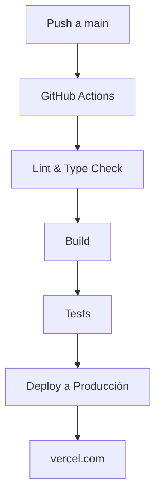
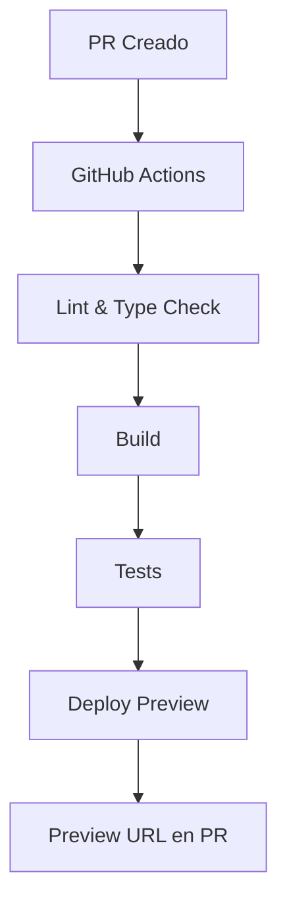

# 🚀 Guía de Despliegue - Cifrix

## Estado Actual

El workflow de GitHub Actions está configurado para desplegar automáticamente a Vercel cuando se hace push a la branch `main`.

## 🔐 Secrets Requeridos

Para que el despliegue automático funcione, necesitas configurar 3 secrets en GitHub:

### 1. VERCEL_TOKEN

**Qué es:** Token de autenticación para desplegar en Vercel

**Cómo obtenerlo:**
1. Ve a https://vercel.com/account/tokens
2. Click en **Create**
3. Dale nombre: `github-actions`
4. Copia el token (solo se muestra una vez)
5. Ve a GitHub → Settings → Secrets and variables → Actions
6. Click en **New repository secret**
7. Nombre: `VERCEL_TOKEN`
8. Valor: (pega el token)

### 2. VERCEL_ORG_ID

**Qué es:** ID de tu organización en Vercel

**Cómo obtenerlo:**
1. Ve a tu dashboard en Vercel
2. Selecciona tu organización
3. Mira la URL: `https://vercel.com/{ORG_ID}/...`
4. El ORG_ID es la parte después de `vercel.com/`

Ejemplo:
```
URL: https://vercel.com/team_KRaFfOe8UEJ2wxh5eekQG7f6/dashboard
ORG_ID: team_KRaFfOe8UEJ2wxh5eekQG7f6
```

5. En GitHub, agrega el secret:
   - Nombre: `VERCEL_ORG_ID`
   - Valor: `team_xxxxxx`

### 3. VERCEL_PROJECT_ID

**Qué es:** ID del proyecto en Vercel

**Cómo obtenerlo:**
1. Ve al proyecto en Vercel
2. La URL es: `https://vercel.com/{ORG_ID}/{PROJECT_ID}`
3. El PROJECT_ID es la parte final

Ejemplo:
```
URL: https://vercel.com/team_KRaFfOe8UEJ2wxh5eekQG7f6/cifrix
PROJECT_ID: cifrix
```

4. En GitHub, agrega el secret:
   - Nombre: `VERCEL_PROJECT_ID`
   - Valor: `cifrix`

## 📋 Pasos para Configurar

### Paso 1: Ir a Settings del Repositorio

```
GitHub → nauzael/Cifrix → Settings → Secrets and variables → Actions
```

### Paso 2: Agregar los 3 Secrets

Click en **New repository secret** y agrega:

| Name | Value |
|------|-------|
| `VERCEL_TOKEN` | Tu token de Vercel |
| `VERCEL_ORG_ID` | Tu org ID |
| `VERCEL_PROJECT_ID` | Tu project ID |

### Paso 3: Verificar

Deberías ver:

```
Repository secrets:
  VERCEL_TOKEN        ••••••••••••••••
  VERCEL_ORG_ID       ••••••••••••••••
  VERCEL_PROJECT_ID   ••••••••••••••••
```

## 🔄 Flujo de Despliegue

### Push a `main`



### Pull Request



## 📊 Workflow Actual

El archivo `.github/workflows/ci.yml` contiene:

1. **lint-and-typecheck**: Valida código y tipos
2. **build**: Compila la aplicación
3. **test**: Ejecuta tests unitarios
4. **deploy-production**: Despliega a producción (solo main)
5. **deploy-preview**: Despliega preview (solo PRs)

## 🚨 Solución de Problemas

### Error: "No default is applied in non-interactive mode"

**Causa:** Faltan los secrets de Vercel

**Solución:**
```bash
# Configura los 3 secrets en GitHub:
VERCEL_TOKEN
VERCEL_ORG_ID
VERCEL_PROJECT_ID
```

### Error: "Project names can be up to 100 characters..."

**Causa:** El nombre del proyecto en Vercel es inválido

**Solución:**
1. Ve a Vercel → Project Settings → General
2. Cambia el nombre a algo válido (minúsculas, números, guiones)

### El build falla en GitHub pero funciona localmente

**Causa común:** Diferencias de entorno

**Solución:**
1. Revisa los logs en GitHub Actions
2. Ejecuta `npm run build` localmente
3. Verifica que no haya errores de TypeScript

### Los tests fallan

**Causa:** Tests frágiles o dependencias de entorno

**Solución:**
1. Ejecuta `npm test` localmente
2. Revisa el error específico
3. Arregla el test o los datos de prueba

## 📈 Monitoreo

### Ver el estado del deployment

1. Ve a la pestaña **Actions** en GitHub
2. Selecciona el workflow **CI - Continuous Integration**
3. Revisa los logs de cada job

### URLs de interés

- **GitHub Actions:** https://github.com/nauzael/Cifrix/actions
- **Vercel Dashboard:** https://vercel.com/dashboard
- **Vercel Activity:** https://vercel.com/{{ORG_ID}}/{{PROJECT_ID}}/activity

## ✅ Checklist de Verificación

- [ ] VERCEL_TOKEN configurado
- [ ] VERCEL_ORG_ID configurado
- [ ] VERCEL_PROJECT_ID configurado
- [ ] Push a main exitoso
- [ ] Workflow ejecutándose en Actions
- [ ] Build completado sin errores
- [ ] Tests pasando (100%)
- [ ] Deploy a Vercel completado
- [ ] URL de producción accesible

## 🎯 Próximos Pasos

1. **Configurar secrets** en GitHub
2. **Hacer push** a main
3. **Monitorear** el workflow en Actions
4. **Verificar** deployment en Vercel
5. **Probar** la landing page en producción

---

**Documentación actualizada:** 2026-05-03  
**Versión:** 1.0.0
