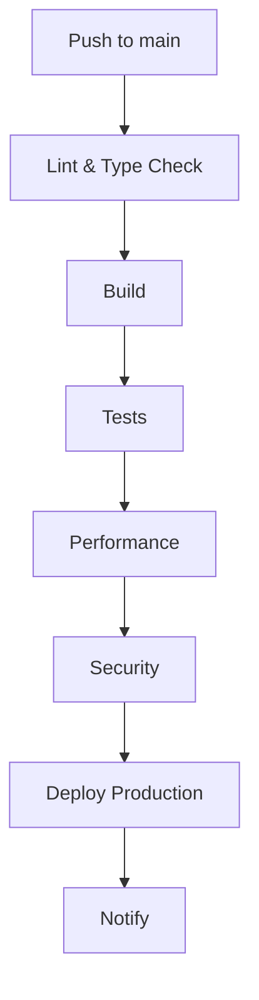
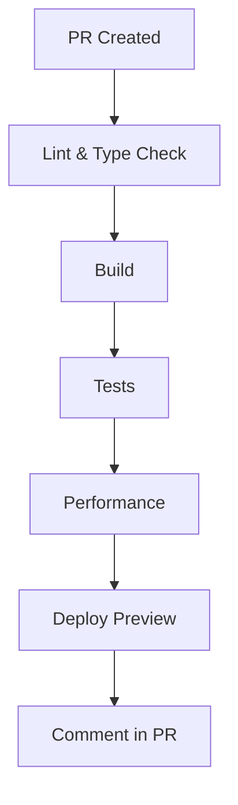

# GitHub Actions Workflows - Cifrix

## 📋 Descripción

Este directorio contiene las configuraciones de GitHub Actions para CI/CD de Cifrix.

## 🔄 Workflows Disponibles

### 1. **CI (ci.yml)** - Integración Continua

**Trigger:** Push o Pull Request a `main` o `develop`

**Jobs:**
1. **Lint & Type Check** - Validación de código y tipos
2. **Build** - Compilación de la aplicación
3. **Test** - Ejecución de tests unitarios
4. **Performance** - Tests de performance con Lighthouse
5. **Security** - Escaneo de seguridad
6. **Deploy Production** - Despliegue a producción (solo main)
7. **Deploy Preview** - Despliegue de preview (solo PRs)
8. **Notify** - Notificaciones opcionales

## 🚀 Configuración Requerida

### Secrets de GitHub

Debes configurar los siguientes secrets en tu repositorio:

```bash
# Ve a: Settings > Secrets and variables > Actions

# Vercel (requerido para deploy)
VERCEL_TOKEN          # Tu token de Vercel
VERCEL_ORG_ID         # ID de organización en Vercel
VERCEL_PROJECT_ID     # ID del proyecto en Vercel

# Opcionales
SNYK_TOKEN            # Token de Snyk para security scanning
DISCORD_WEBHOOK       # Webhook de Discord para notificaciones
```

### Cómo obtener los tokens de Vercel:

1. **VERCEL_TOKEN:**
   - Ve a https://vercel.com/account/tokens
   - Crea un nuevo token
   - Copia y guárdalo como `VERCEL_TOKEN`

2. **VERCEL_ORG_ID:**
   - Ve a tu dashboard de Vercel
   - Selecciona tu organización
   - El ID está en la URL: `vercel.com/{ORG_ID}/...`

3. **VERCEL_PROJECT_ID:**
   - Ve al proyecto en Vercel
   - El ID está en la URL: `vercel.com/{ORG_ID}/{PROJECT_ID}`

## 📊 Flujo de Trabajo

### Push a `main`



### Pull Request



## 🎯 Jobs Detallados

### 1. Lint & Type Check
- **Runner:** ubuntu-latest
- **Pasos:**
  - Checkout del código
  - Setup Node.js 20
  - Install dependencies (npm ci)
  - ESLint
  - TypeScript type check

### 2. Build
- **Runner:** ubuntu-latest
- **Dependencias:** lint-and-typecheck
- **Pasos:**
  - Checkout
  - Setup Node.js
  - Install dependencies
  - npm run build
  - Upload dist/ artifact

### 3. Test
- **Runner:** ubuntu-latest
- **Pasos:**
  - Checkout
  - Setup Node.js
  - Install dependencies
  - npm run test
  - Upload coverage reports

### 4. Performance
- **Runner:** ubuntu-latest
- **Dependencias:** build
- **Condiciones:** PR o main
- **Pasos:**
  - Checkout
  - Setup Node.js
  - Install dependencies
  - Download build
  - Serve build
  - Lighthouse CI
  - Upload report

### 5. Security
- **Runner:** ubuntu-latest
- **Pasos:**
  - Checkout
  - Setup Node.js
  - Install dependencies
  - npm audit
  - Snyk scan

### 6. Deploy Production
- **Runner:** ubuntu-latest
- **Dependencias:** lint-and-typecheck, build, test
- **Condiciones:** main branch, push event
- **Pasos:**
  - Checkout
  - Download build
  - Deploy to Vercel (prod)
  - Summary

### 7. Deploy Preview
- **Runner:** ubuntu-latest
- **Dependencias:** lint-and-typecheck, build, test
- **Condiciones:** PR event
- **Pasos:**
  - Checkout
  - Download build
  - Deploy to Vercel (preview)
  - Summary

## 🔧 Personalización

### Cambiar umbrales de performance

Edita `ci.yml` en el job `performance`:

```yaml
--assert.performance.minScore=0.9
--assert.accessibility.minScore=0.9
--assert.seo.minScore=0.85
```

### Agregar notificaciones

Descomenta la sección de notificaciones en `ci.yml`:

```yaml
# Discord
curl -X POST -H "Content-Type: application/json" \
  -d "{\"content\":\"Deployed: ${GITHUB_REF}\"}" \
  "${{ secrets.DISCORD_WEBHOOK }}"

# Slack
curl -X POST -H "Content-Type: application/json" \
  -d "{\"text\":\"Deployed: ${GITHUB_REF}\"}" \
  "${{ secrets.SLACK_WEBHOOK }}"
```

## 📈 Monitoreo

### Ver el estado de los workflows

1. Ve a la pestaña **Actions** en GitHub
2. Selecciona el workflow que quieres ver
3. Revisa los logs de cada job

### Métricas clave

- **Build time:** Tiempo total del workflow
- **Test coverage:** % de código testeado
- **Performance scores:** Lighthouse scores
- **Deploy status:** Éxito/Fallo del deploy

## 🐛 Solución de Problemas

### El build falla

1. Revisa los logs en GitHub Actions
2. Ejecuta `npm run build` localmente
3. Verifica que no haya errores de TypeScript

### Los tests fallan

1. Revisa los logs del job `test`
2. Ejecuta `npm test` localmente
3. Asegúrate de que todos los tests pasen

### El deploy falla

1. Verifica que los secrets de Vercel estén correctos
2. Revisa los logs del job `deploy-production`
3. Confirma que el build sea exitoso

### Performance score bajo

1. Revisa el reporte de Lighthouse
2. Optimiza imágenes y bundles
3. Implementa code splitting si es necesario

## 📚 Recursos Adicionales

- [GitHub Actions Documentation](https://docs.github.com/en/actions)
- [Vercel GitHub Action](https://github.com/marketplace/actions/vercel-action)
- [Lighthouse CI](https://github.com/GoogleChrome/lighthouse-ci)
- [Snyk Action](https://github.com/snyk/actions)

## 🎯 Mejores Prácticas

1. **Mantener secrets actualizados** - Rota tokens periódicamente
2. **Revisar logs regularmente** - Detecta problemas temprano
3. **Monitorear performance** - Establece alerts para scores bajos
4. **Tests en cada PR** - No merges sin tests passing
5. **Deploy automático** - Solo después de validaciones

---

**Última actualización:** 2026-05-02
**Versión:** 1.0.0
