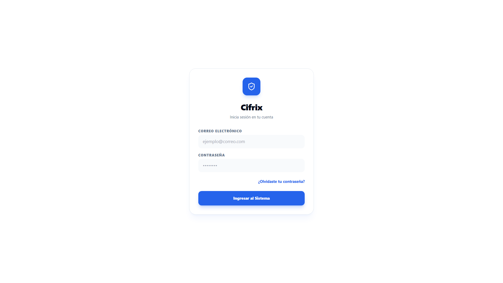
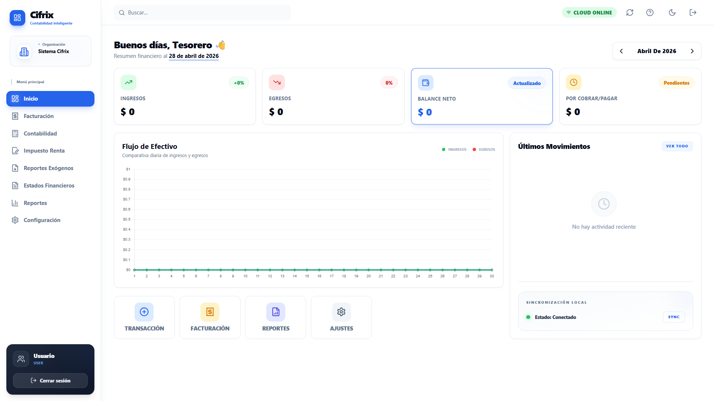
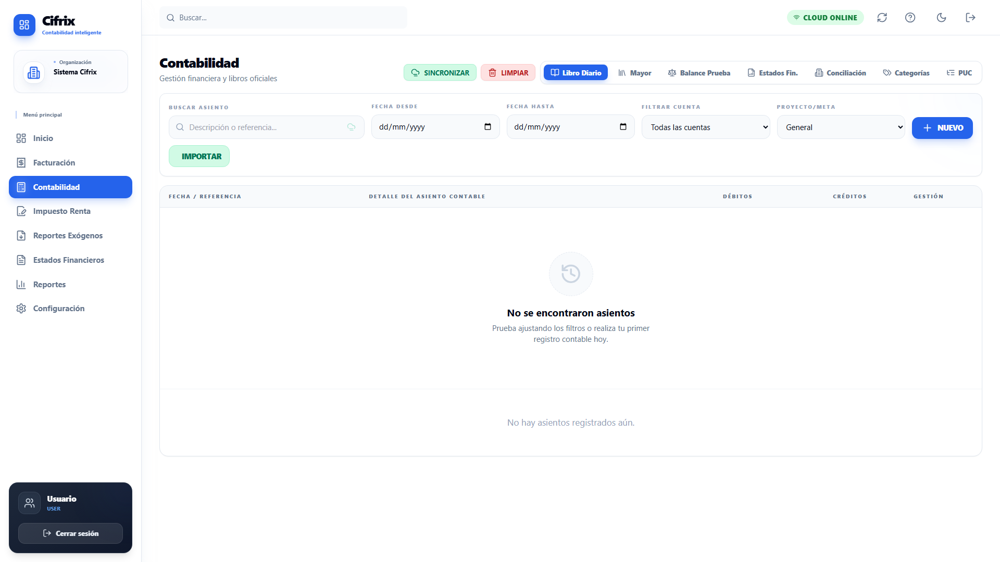
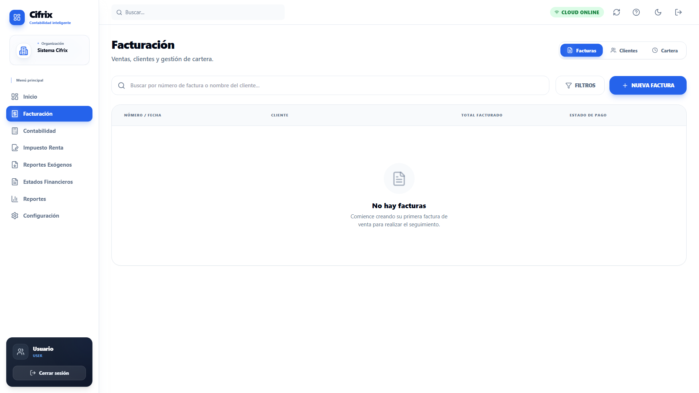
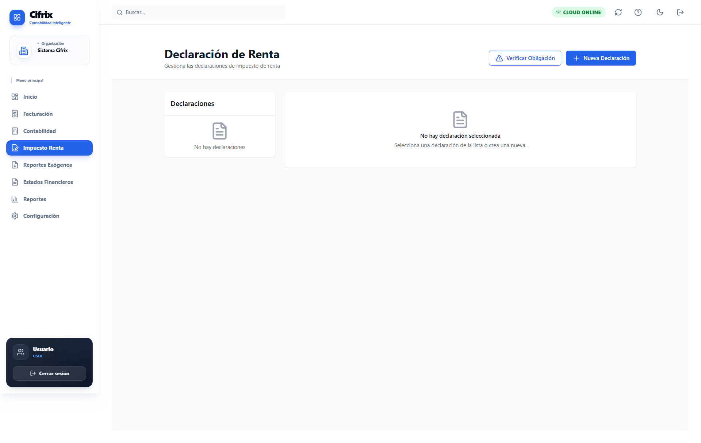
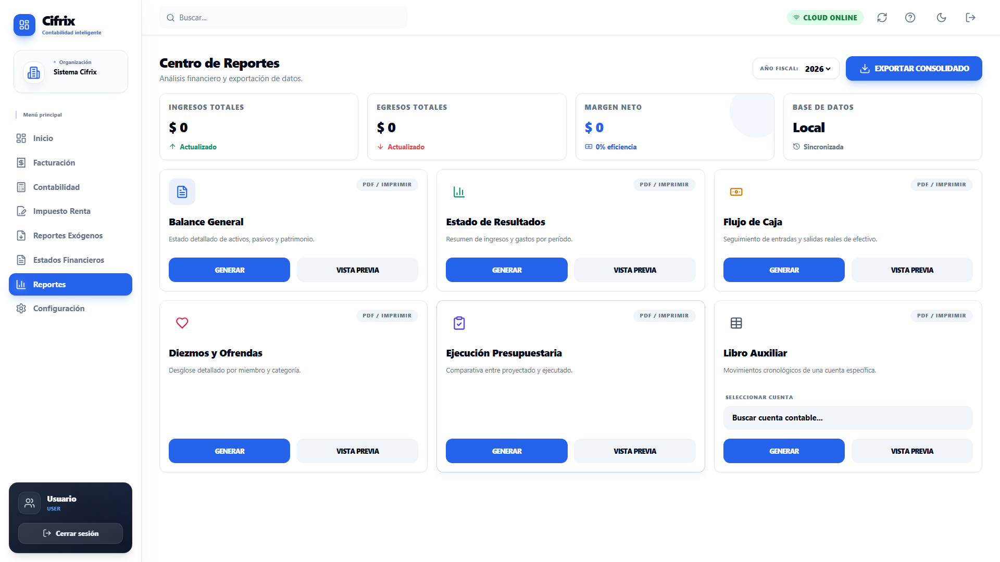
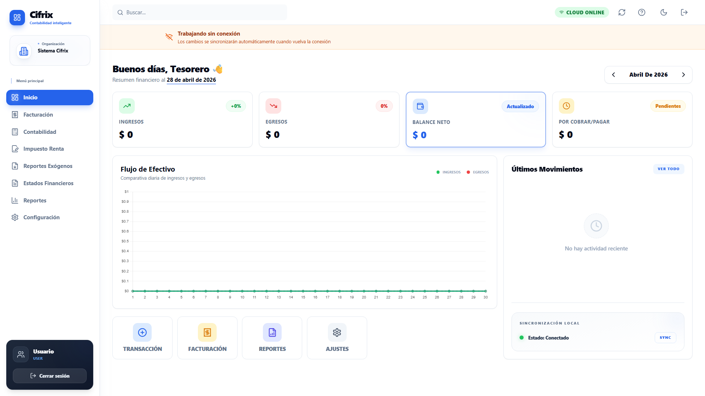
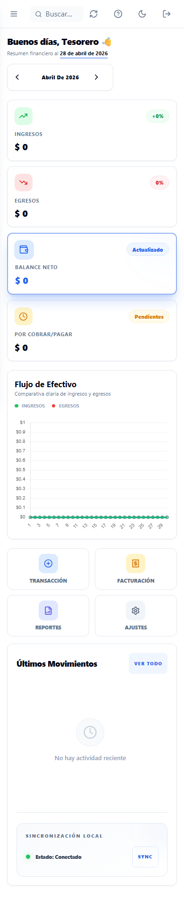

# 🎯 Cifrix - Sistema de Contabilidad Integral

**Plataforma de gestión contable en Colombia con arquitectura offline-first**

Platform for accounting management in Colombia with offline-first architecture and complete feature set for modern accounting needs.

---

## ✨ Características Principales

- ✅ **Contabilidad Completa** - Plan de Cuentas (PUC), Asientos Contables, Reportes
- ✅ **Facturación Electrónica** - Generación de facturas según normas DIAN
- ✅ **Declaración de Renta** - Módulo integrado para cálculo de impuestos
- ✅ **Reportes Exógenos** - Reportes de operaciones realizadas
- ✅ **Módulo Eclesiástico** - Soporte para iglesias y diezmos (trazabilidad)
- ✅ **Modo Offline Completo** - Funciona sin conexión a internet
- ✅ **Sincronización Automática** - Sincroniza cambios cuando hay conexión
- ✅ **PWA - Progressive Web App** - Instálable como aplicación nativa
- ✅ **Exportación Múltiple** - Excel, PDF, CSV
- ✅ **Múltiples Organizaciones** - Gestiona varios negocios en una cuenta
- ✅ **Control de Acceso** - Roles y permisos basados en usuarios
- ✅ **Dashboard Inteligente** - Visualización de datos en tiempo real
- ✅ **Reportes Avanzados** - Análisis financiero integrado

---

## 🛠️ Stack Tecnológico

| Capa | Tecnología |
|------|-----------|
| **Frontend** | React 18, TypeScript, Tailwind CSS |
| **State Management** | Zustand, React Query |
| **Formularios** | React Hook Form + Zod |
| **Base de Datos** | Supabase (PostgreSQL) + Dexie (offline) |
| **Sincronización** | Service Workers, IndexedDB, Dexie |
| **Componentes UI** | Radix UI, Lucide Icons, shadcn/ui |
| **Gráficos** | Chart.js, Recharts |
| **Reportes** | jsPDF, XLSX, html2pdf |
| **Build Tool** | Vite 6, TypeScript |
| **Testing** | Vitest, Testing Library |
| **Deployment** | Vercel |
| **PWA** | Vite PWA Plugin, Workbox |

---

## 📸 Screenshots

### Interfaz de Autenticación

*Página de login seguro con autenticación Supabase*

### Dashboard Principal

*Dashboard inteligente con resumen financiero en tiempo real y widgets interactivos*

### Módulo de Contabilidad

*Plan de cuentas, asientos contables y gestión financiera completa*

### Módulo de Facturación

*Generación de facturas electrónicas según normas DIAN*

### Módulo de Renta

*Declaración de impuestos sobre la renta con cálculos automáticos*

### Reportes y Análisis

*Reportes avanzados con gráficas interactivas y análisis financiero*

### Modo Offline

*Funciona completamente sin conexión a internet con sincronización automática*

### Diseño Responsive

*Interfaz completamente responsive compatible con dispositivos móviles (iOS y Android)*

---

## 📋 Requisitos Previos

- **Node.js** 18.0.0 o superior
- **npm** 8+ o **yarn** 3+
- **Cuenta de Supabase** (gratuita en https://supabase.com)
- Variables de entorno configuradas (ver `.env.example`)

### Navegadores Soportados

- ✅ Chrome 90+
- ✅ Firefox 88+
- ✅ Safari 15+
- ✅ Edge 90+
- ✅ Chrome Mobile (Android)
- ✅ Safari Mobile (iOS)

---

## 🚀 Instalación Rápida

### 1. Clonar el Repositorio

```bash
git clone https://github.com/nauzael/Cifrix.git
cd Cifrix
```

### 2. Instalar Dependencias

```bash
npm install
# o
yarn install
```

### 3. Configurar Variables de Entorno

```bash
# Copiar archivo de ejemplo
cp .env.example .env.local

# Editar .env.local con tus credenciales
# Necesitas agregar:
#   - VITE_SUPABASE_URL
#   - VITE_SUPABASE_ANON_KEY
```

Obtén las credenciales en:
1. Ve a https://app.supabase.com
2. Selecciona tu proyecto
3. Ve a Settings → API
4. Copia la URL y Anon Key

### 4. Ejecutar Servidor de Desarrollo

```bash
npm run dev
```

Abrirá automáticamente en: **http://localhost:5174**

---

## 💻 Comandos Disponibles

```bash
# Desarrollo (con hot reload)
npm run dev

# Build para producción
npm run build

# Preview del build de producción
npm run preview

# Ejecutar tests
npm test

# Tests en modo watch (rerun on changes)
npm run test:watch

# Generar coverage report
npm run test:coverage

# Validar código (ESLint)
npm run lint

# Type checking sin emitir código
npm run check

# Limpiar caché y archivos generados
npm run clean
```

---

## 🔐 Variables de Entorno

Crea un archivo `.env.local` en la raíz del proyecto:

```bash
# Supabase (requerido)
VITE_SUPABASE_URL=https://your-project.supabase.co
VITE_SUPABASE_ANON_KEY=your_anon_key

# Configuración de Offline
VITE_OFFLINE_MODE=true
VITE_SYNC_INTERVAL_MS=180000

# Feature Flags
VITE_ENABLE_RENTA=true
VITE_ENABLE_EXOGENOS=true
VITE_ENABLE_DIEZMOS=true

# Debug
VITE_DEBUG_MODE=false
VITE_LOG_LEVEL=info
```

Para documentación completa, ver [.env.example](.env.example)

---

## 🏗️ Arquitectura

### Offline-First Architecture

Cifrix implementa una arquitectura offline-first robusta:

```
┌─────────────────────────────────────┐
│      React UI Components            │
└──────────────┬──────────────────────┘
               │
┌──────────────▼──────────────────────┐
│   State Management (Zustand)        │
│   + React Query (Server State)      │
└──────────────┬──────────────────────┘
               │
    ┌──────────┴──────────┐
    │                     │
┌───▼──────────┐   ┌─────▼──────────┐
│   IndexedDB  │   │   Supabase     │
│   (Dexie)    │   │   (PostgreSQL) │
│   LOCAL      │   │   CLOUD        │
└──────────────┘   └────────────────┘
    ▲                    ▲
    └────────┬───────────┘
             │
     Service Worker
    (Sync Manager)
```

**Características:**
- Datos se guardan automáticamente en IndexedDB
- Funciona 100% sin conexión a internet
- Sincronización automática cuando hay conexión (cada 3 minutos)
- Detección de conflictos y resolución automática
- PWA permite instalación como app nativa
- Works offline, syncs when online

### Módulos Principales

#### 1. **Contabilidad** 📊
- Plan de Cuentas (PUC Colombiano)
- Asientos contables con validación
- Mayor contable
- Balance de prueba
- Reportes: Estado de Resultados, Balance General

#### 2. **Facturación** 📄
- Creación de facturas electrónicas
- Numeración automática
- Integración con DIAN (formato XML)
- Descuentos y retenciones
- Historial de facturas

#### 3. **Declaración de Renta** 💰
- Cálculo automático de impuestos
- Declaración anual
- Anexos y soportes
- Exportación de formatos DIAN

#### 4. **Reportes Exógenos** 📋
- Información de operaciones
- Dividendos y participaciones
- Pagos y abonos en cuenta
- Exportación en formato DIAN

#### 5. **Módulo Eclesiástico** ⛪
- Gestión de diezmos
- Trazabilidad de donaciones
- Reportes por miembro
- Control de asistencia

#### 6. **Gestión de Usuarios** 👥
- Autenticación con Supabase
- Control de acceso basado en roles (RBAC)
- Múltiples organizaciones
- Auditoría de cambios

---

## 🔄 Sincronización Offline

Los cambios se sincronizan automáticamente en estos casos:

1. **Al conectarse a internet** - Si estaba offline
2. **Cada 3 minutos** - Sincronización programada (configurable)
3. **Al hacer click** - Botón "Sincronizar ahora" en la UI
4. **Al cambiar de pestaña** - Sincronización en segundo plano

**Características de sync:**
- ✅ Detección inteligente de cambios
- ✅ Resolución automática de conflictos
- ✅ Retry automático en caso de error
- ✅ Notificaciones de estado
- ✅ Progress tracking

---

## 📱 Plataformas Soportadas

| Plataforma | Soporte | Notas |
|-----------|---------|-------|
| **Web (Desktop)** | ✅ Total | Chrome, Firefox, Safari, Edge |
| **Web (Mobile)** | ✅ Total | iOS Safari, Chrome Mobile |
| **Progressive Web App** | ✅ Total | Instálable como app nativa |
| **Offline Mode** | ✅ Completo | Funciona 100% sin conexión |
| **Desktop App** | ⏳ Próximamente | Electron wrapper en roadmap |

---

## 📚 Documentación Adicional

Explorar la documentación en carpeta `docs/`:

```
docs/
├── migrations/        # Migraciones de base de datos
├── technical/         # Documentación técnica detallada
├── plans/            # Planes de diseño e implementación
└── CODIGOS-DIAN-*.md # Códigos y homologaciones DIAN
```

**Documentos destacados:**
- [Offline Auth Documentation](docs/technical/offline-auth-documentation.md) - Implementación de autenticación offline
- [DIAN Homologación](docs/homologacion-dian-puc.md) - Integración con DIAN
- [PUC Excel Import](docs/plans/2026-03-26-puc-excel-import-design.md) - Importar PUC desde Excel

---

## 🤝 Contribuciones

¡Las contribuciones son bienvenidas! Sigue estos pasos:

### 1. Fork el Repositorio
```bash
# En GitHub, haz click en "Fork"
```

### 2. Clona tu Fork
```bash
git clone https://github.com/TU_USUARIO/Cifrix.git
cd Cifrix
```

### 3. Crea una Rama Feature
```bash
git checkout -b feature/mi-caracteristica
# o
git checkout -b fix/mi-fix
```

### 4. Haz tus Cambios
- Escribe código limpio
- Sigue las convenciones del proyecto
- Agrega tests si es necesario

### 5. Commit con Conventional Commits
```bash
git commit -m "feat: agrega nueva característica"
# o
git commit -m "fix: arregla un bug"
```

### 6. Push a tu Fork
```bash
git push origin feature/mi-caracteristica
```

### 7. Abre un Pull Request
- Ve a GitHub y abre un PR
- Describe los cambios claramente
- Espera el review

Para detalles completos, ver [CONTRIBUTING.md](CONTRIBUTING.md)

---

## 🐛 Reportar Bugs

Si encuentras un bug, por favor abre un [Issue](https://github.com/nauzael/Cifrix/issues) con:

1. **Título descriptivo** - Resumen del problema
2. **Descripción clara** - Qué está pasando
3. **Pasos para reproducir** - Cómo lo causaste
4. **Comportamiento esperado** - Qué debería pasar
5. **Ambiente** - Browser, OS, versión Node.js
6. **Screenshots** - Si aplica

---

## 💡 Sugerencias y Feature Requests

Tienes una idea? Comparte en:

- [GitHub Discussions](https://github.com/nauzael/Cifrix/discussions) - Conversaciones generales
- [GitHub Issues](https://github.com/nauzael/Cifrix/issues) - Feature requests formales

---

## 📄 Licencia

Este proyecto está bajo la licencia [MIT](LICENSE) - libre para uso personal y comercial.

---

## 👨‍💻 Autor

**Nauzael**

- GitHub: [@nauzael](https://github.com/nauzael)
- Email: Contacto a través de GitHub Issues

---

## 🙏 Agradecimientos

Gracias a:
- La comunidad de React
- Supabase por la excelente plataforma
- Todos los contribuyentes

---

## 📞 Soporte

¿Necesitas ayuda?

1. **Lee la documentación** - [docs/](docs/)
2. **Busca issues existentes** - [GitHub Issues](https://github.com/nauzael/Cifrix/issues)
3. **Abre una discusión** - [GitHub Discussions](https://github.com/nauzael/Cifrix/discussions)
4. **Reporta un bug** - [GitHub Issues](https://github.com/nauzael/Cifrix/issues/new)

---

## 🚀 Roadmap

### Próximas Características
- 🔄 Aplicación Desktop (Electron)
- 📱 Aplicación Mobile Nativa (React Native)
- 🤖 IA para categorización automática
- 📊 Reportes avanzados con BI
- 🔐 Autenticación 2FA mejorada
- 📧 Notificaciones por email
- 🌐 Soporte multiidioma

---

## 📊 Estadísticas del Proyecto

- **Lenguaje Principal:** TypeScript
- **Framework:** React 18
- **Database:** PostgreSQL (Supabase)
- **PWA:** Sí, instalable
- **Offline:** Sí, completamente funcional
- **Mobile:** Responsive, optimizado para móviles

---

<div align="center">

**Made with ❤️ for Colombian Accountants**

[⬆ Volver al inicio](#-cifrix---sistema-de-contabilidad-integral)

</div>
