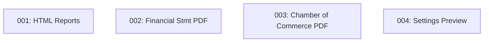

# Execution Plan: Logo Fixed Percentage

## Goal
Implement a unified logo sizing system (18% fluid width with max-height cap) across HTML/PDF reports and add a preview in settings.

## Architecture & Constraints
- **Reports.tsx**: Uses standard TailwindCSS within an HTML template.
- **jsPDF Reports**: Requires calculating image dimensions and aspect ratio manually before adding to the document.
- **Settings.tsx**: Extends the existing organization form with a preview component.

## BDD Coverage
All scenarios in `/bdd-specs.md` are covered by these tasks.

## Tasks

### Phase 1: HTML Reports Refinement
- [Task 001: HTML Logo Container Implementation](./task-001-reports-html-impl.md)

### Phase 2: PDF Generation Optimization
- [Task 002: Financial Statements PDF Logo Sizing Implementation](./task-002-financial-statements-pdf-impl.md)
- [Task 003: Chamber of Commerce PDF Logo Sizing Implementation](./task-003-chamber-commerce-pdf-impl.md)

### Phase 3: Settings Enhancement
- [Task 004: Settings Logo Preview Implementation](./task-004-settings-preview-impl.md)

## Dependency Chain

